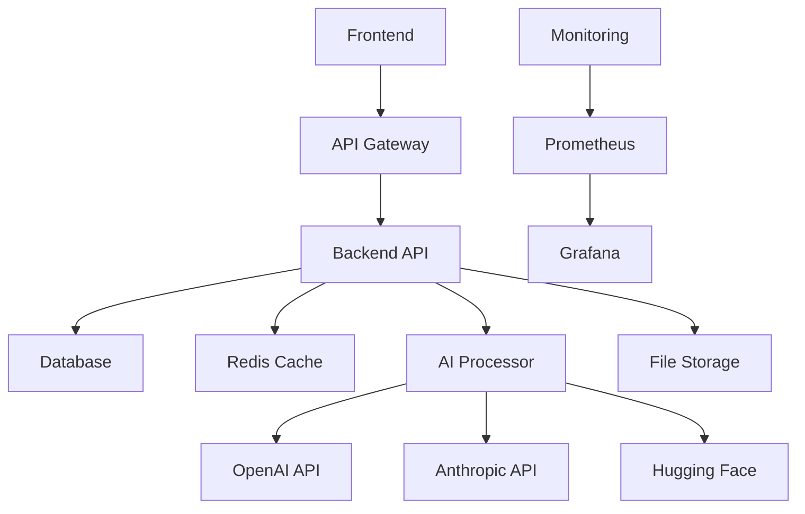

# Red.AI Architecture Documentation

## 🏗️ Архитектура проекта

Red.AI — это современная fullstack платформа для генерации дизайна интерьеров с помощью искусственного интеллекта. Проект построен на микросервисной архитектуре с четким разделением ответственности.

## 📁 Структура проекта

```
Red.AI/
├── src/                          # Исходный код
│   ├── backend/                  # Backend API (FastAPI)
│   │   ├── core/                 # Основные модули
│   │   │   ├── config.py         # Конфигурация
│   │   │   ├── database.py       # База данных
│   │   │   ├── middleware.py     # Middleware
│   │   │   └── exceptions.py     # Обработка исключений
│   │   ├── api/                  # API endpoints
│   │   │   └── v1/               # Версия 1 API
│   │   │       ├── router.py     # Главный роутер
│   │   │       └── endpoints/    # Конкретные endpoint'ы
│   │   ├── models/               # SQLAlchemy модели
│   │   ├── schemas/              # Pydantic схемы
│   │   ├── services/             # Бизнес-логика
│   │   └── main.py               # Точка входа
│   ├── frontend/                 # Frontend (Next.js + React)
│   │   ├── components/           # React компоненты
│   │   │   ├── common/           # Общие компоненты
│   │   │   ├── ui/               # UI компоненты
│   │   │   └── pages/            # Страничные компоненты
│   │   ├── hooks/                # React hooks
│   │   ├── utils/                # Утилиты
│   │   └── styles/               # Стили (Tailwind CSS)
│   ├── ai_models/                # AI/ML модели
│   │   ├── base/                 # Базовые классы
│   │   ├── image_generation/     # Генерация изображений
│   │   ├── text_processing/      # Обработка текста
│   │   └── room_analysis/        # Анализ помещений
│   ├── database/                 # База данных
│   │   ├── models/               # Модели данных
│   │   ├── migrations/           # Миграции
│   │   └── seeds/                # Тестовые данные
│   └── tests/                    # Тесты
│       ├── unit/                 # Unit тесты
│       ├── integration/          # Интеграционные тесты
│       └── e2e/                  # End-to-end тесты
├── docker/                       # Docker конфигурация
│   ├── docker-compose.yml        # Композиция сервисов
│   ├── Dockerfile.backend        # Backend Dockerfile
│   ├── Dockerfile.frontend       # Frontend Dockerfile
│   └── nginx.conf                # Nginx конфигурация
├── docs/                         # Документация
│   ├── ARCHITECTURE.md           # Архитектура (этот файл)
│   ├── API.md                    # API документация
│   ├── DEPLOYMENT.md             # Деплой
│   └── DEVELOPMENT.md            # Разработка
├── requirements/                 # Python зависимости
│   ├── base.txt                  # Базовые зависимости
│   ├── dev.txt                   # Для разработки
│   └── prod.txt                  # Для продакшена
├── scripts/                      # Скрипты
│   ├── start-dev.sh              # Запуск разработки
│   ├── deploy.sh                 # Деплой
│   └── backup.sh                 # Резервное копирование
├── .env.example                  # Пример переменных окружения
├── .gitignore                    # Git ignore
├── package.json                  # Node.js зависимости
├── requirements.txt              # Python зависимости
└── README.md                     # Главный README
```

## 🏛️ Архитектурные принципы

### 1. Микросервисная архитектура
- **Backend API**: FastAPI сервис для обработки запросов
- **Frontend**: Next.js приложение для пользовательского интерфейса
- **AI Processor**: Отдельный сервис для AI обработки
- **Database**: PostgreSQL для хранения данных
- **Cache**: Redis для кэширования

### 2. Разделение ответственности
- **Presentation Layer**: Frontend (Next.js + React)
- **API Layer**: Backend API endpoints (FastAPI)
- **Business Logic**: Services и модели
- **Data Layer**: Database models и repositories
- **AI Layer**: AI/ML модели и сервисы

### 3. Принципы SOLID
- **Single Responsibility**: Каждый модуль имеет одну ответственность
- **Open/Closed**: Расширяемость через интерфейсы
- **Liskov Substitution**: Правильная иерархия классов
- **Interface Segregation**: Маленькие, специализированные интерфейсы
- **Dependency Inversion**: Зависимости от абстракций

## 🔧 Технологический стек

### Backend
- **FastAPI** - Современный веб-фреймворк для API
- **SQLAlchemy** - ORM для работы с базой данных
- **Alembic** - Миграции базы данных
- **PostgreSQL** - Основная база данных
- **Redis** - Кэширование и очереди
- **Celery** - Асинхронные задачи
- **Pydantic** - Валидация данных

### Frontend
- **Next.js** - React фреймворк
- **React** - Библиотека для UI
- **TypeScript** - Типизированный JavaScript
- **Tailwind CSS** - Utility-first CSS фреймворк
- **ShadCN/UI** - Компоненты UI
- **Zustand** - Управление состоянием

### AI/ML
- **OpenAI API** - DALL-E, GPT для генерации
- **Anthropic Claude** - Альтернативный AI сервис
- **Hugging Face** - Модели с открытым исходным кодом
- **PyTorch** - Фреймворк для машинного обучения
- **Transformers** - Предобученные модели
- **Diffusers** - Модели диффузии

### DevOps
- **Docker** - Контейнеризация
- **Docker Compose** - Оркестрация контейнеров
- **Nginx** - Reverse proxy и статические файлы
- **Prometheus** - Мониторинг
- **Grafana** - Дашборды мониторинга

## 🔄 Поток данных



## 📊 Компоненты системы

### 1. Frontend (Next.js)
- **Компоненты**: Переиспользуемые UI компоненты
- **Страницы**: Маршруты приложения
- **Хуки**: Логика состояния и API вызовов
- **Утилиты**: Вспомогательные функции
- **Стили**: Tailwind CSS для стилизации

### 2. Backend API (FastAPI)
- **Endpoints**: REST API для frontend
- **Middleware**: CORS, аутентификация, логирование
- **Models**: SQLAlchemy модели данных
- **Schemas**: Pydantic схемы для валидации
- **Services**: Бизнес-логика приложения

### 3. AI Processing Service
- **DALL-E Service**: Генерация изображений
- **GPT Service**: Обработка текста
- **Room Analysis**: Анализ помещений
- **Style Transfer**: Перенос стилей

### 4. Database Layer
- **PostgreSQL**: Основная база данных
- **Redis**: Кэширование и сессии
- **File Storage**: Хранение изображений

## 🔐 Безопасность

### Аутентификация и авторизация
- **JWT токены** для аутентификации
- **Role-based access control** для авторизации
- **Password hashing** с bcrypt
- **Session management** через Redis

### Безопасность API
- **CORS** настройки
- **Rate limiting** для предотвращения злоупотреблений
- **Input validation** с Pydantic
- **Security headers** через middleware

### Безопасность данных
- **Encryption at rest** для чувствительных данных
- **Secure file uploads** с валидацией
- **Environment variables** для секретов
- **Regular security updates** зависимостей

## 📈 Масштабируемость

### Горизонтальное масштабирование
- **Stateless API** для легкого масштабирования
- **Load balancing** через Nginx
- **Database connection pooling**
- **CDN** для статических файлов

### Производительность
- **Async/await** для неблокирующих операций
- **Caching** стратегии с Redis
- **Background tasks** с Celery
- **Database indexing** для быстрых запросов

## 🧪 Тестирование

### Стратегия тестирования
- **Unit Tests**: Тестирование отдельных модулей
- **Integration Tests**: Тестирование взаимодействия
- **End-to-End Tests**: Тестирование пользовательских сценариев
- **Performance Tests**: Нагрузочное тестирование

### Инструменты тестирования
- **pytest** для Python тестов
- **Jest** для JavaScript тестов
- **Cypress** для E2E тестирования
- **Postman** для API тестирования

## 🚀 Развертывание

### Стадии развертывания
1. **Development**: Локальная разработка
2. **Staging**: Тестовая среда
3. **Production**: Продакшен среда

### CI/CD Pipeline
- **GitHub Actions** для автоматизации
- **Docker** для контейнеризации
- **Automated testing** перед деплоем
- **Rolling deployments** для zero-downtime

## 📚 Дополнительные ресурсы

- [API Documentation](./API.md)
- [Development Guide](./DEVELOPMENT.md)
- [Deployment Guide](./DEPLOYMENT.md)
- [Contributing Guidelines](./CONTRIBUTING.md)

---

*Последнее обновление: 2024-01-15* 